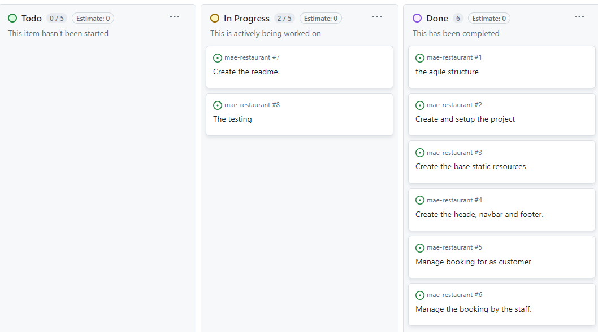
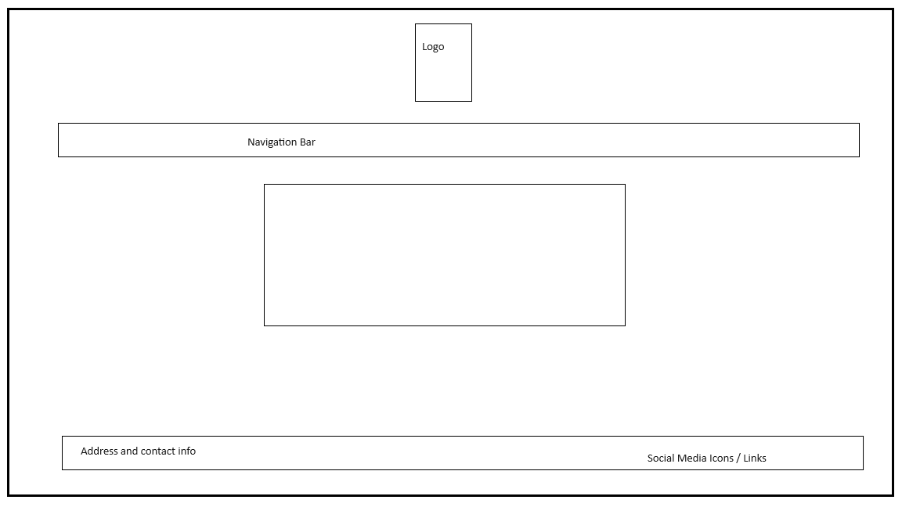
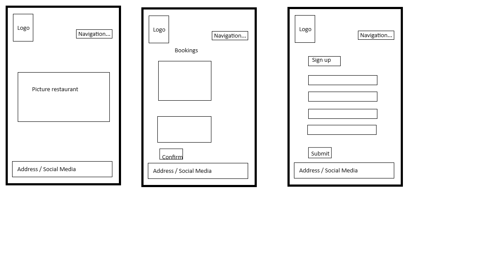
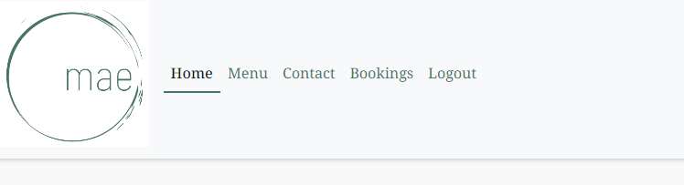
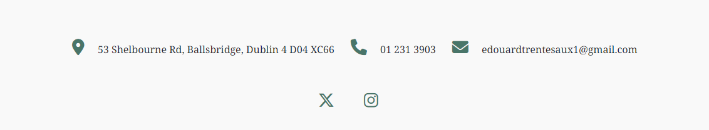
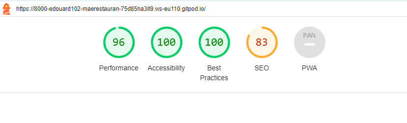

# **Mae restaurent**

![responsicemockup]https://ui.dev/amiresponsive?url=https://mae-restaurant-fd1d9cf11a78.herokuapp.com/

![herokuapp]https://mae-restaurant-fd1d9cf11a78.herokuapp.com/

## Project
### Project Goals
The main objective of this project was to create a website for a restaurant, providing customers with the opportunity to explore the offer. In addition to allowing users to reserve a table as members or first-time visitors, the application allows these users to update or delete their own reservations. Staff members, on the other hand, can create reservations for customers and have the authority to modify or delete them. In summary, the site aims to offer a comprehensive experience for users and staff in discovering the restaurant and managing reservations.

### User Goals

 # UX

### **Audience Definition**

A restaurant is a limited space where not everyone can be accommodated. This place aims to offer future customers a pleasant and friendly experience for a defined period. Regarding the website, it should reflect the type of restaurant, enabling the filtering of a specific clientele. The determination of the potential customer begins with the visit to the website, where they can get an idea of the place.

### **User Stories**

Here is a concise list of actions that a potential user might consider during their visit to this website:

As a user, I want to:

Land on a homepage presenting the core content of the site and providing intuitive navigation.
Access a menu section to get an overview of the available options.
Learn more about the restaurant and its features.
Make a reservation without having to subscribe to a newsletter or other services.
Second Visit:

As a subscribed user, I want to:

Be able to register on the site to create an account allowing access to the history and future reservations.
Make new reservations as a registered user.
Have the option to modify and/or delete the reservations I've made.
Be able to log out and log back into the site without encountering any specific difficulties.

Input validation and error checking.
validation

# Features to Implement in the Future Versions

While the website fulfills the basic functions of a restaurant site, there are additional features that could be added:
Visual Gallery: Integrate an attractive photo gallery showcasing the restaurant's ambiance, popular dishes, and special moments to give visitors a better idea of the experience they can expect.

Reviews and Testimonials: Add a section where customers can leave reviews and testimonials. 
Implementation of a personalized and effective newsletter service that stands out from other newsletter services.
Integration of a system to send discounts to registered users.
Online Loyalty Program: Establish an online loyalty program to reward frequent customers with special offers, discounts, or exclusive benefits.
Reservation Customization Options: Offer customers the ability to specify special requests during reservations, such as dietary preferences or particular celebrations.

## Planning
Project planning was done with Agile methodologies.

## Website Design

### Color Palette:

* Primary (Background): #abb8c3 (a shade of gray-blue)
* --white-Smoke: #F9F9F9; 
* Text: green #497569 
The primary background (gray-blue) will provide an interesting visual contrast.

### Fonts:

Headings: Noto Serif Georgian, sans-serif

Body Text: Noto Serif Georgian, sans-serif

Noto Serif Georgian a serif font that adds a touch of elegance.

I use the same color palette throughout the entire site to create a cohesive and harmonious experience.

# Wirframe

The following designs are from the initial concept of the website. During the development process, some changes have been made to better fit and improve the user experience.
- Base template wide

- Base template phone

- Header
At the top right, you'll find the restaurant's logo along with links to the three main pages. This will give you easy access to all pages. The navigation bar includes links to the Home, Menu, About and Login - Reservation. It remains consistent across all pages, allowing users to navigate easily between them.

- Footer

Here are the various links to social media platforms such as Facebook and Instagram for Mae restaurant, along with its contact information. We will include them on all pages for a consistent experience across the site.

# Technologies Used
### Programming Languages
This project uses Python, htlm, Css

### Frameworks, Libraries and Programs

* [codeanywhere](https://app.codeanywhere.com/)  
  For Integrated Development Environment.

* [GitPod](https://www.gitpod.io/)  
  For Integrated Development Environment.

* [GitHub](https://github.com/)  
  For storing the repository.

* [heroku Pages](https://dashboard.heroku.com/apps)  
  For deploying the website live.

# Technologies Used

Below is a list of the main technologies used for this project.

* HTML5 / CSS
* Bootstrap
* Python
* JavaScript
* cloudjango allauth library
* django
* gunicorn
* elephantsql
* postgresql
* Google fonts

# Deployment

The project was deployed following the instructions provided by the Code Institute.

- Create new app in heroku
- Setup the setting in Heroku

   Config Vars
    * CLOUDINARY_URL
    * DATABASE_URL
    * DEVELOPMENT
    * DISABLE_COLLECTSTATIC
    * SECRET_KEY

- Setup the deploy in Heroku
    * Link Heroku app to the repository Githup
    * Chose the deployment method

- Click on view to see the app

# Testing

## Validator testing

No major errors were found when passing through the PEP 8 and the W3 HTML Validator

### Manual Testing

The manual testing for creating, deleting, or updating a reservation, as well as for adding a new user, was successful.

## Bugs
example of bug :

* error login logout 
since implanted allauth i can't login or log out.

Forbidden (Origin checking failed - https://8000-edouard102-maerestauran-i5joeeajh4a.ws-eu110.gitpod.io does not match any trusted origins.): /admin/login/ [31/Mar/2024 11:10:18] "POST /admin/login/?next=/admin/ HTTP/1.1" 403 2615

solution fund 
in https://stackoverflow.com/questions/77208322/forbidden-origin-checking-failed-https-api-example-com-does-not-match-any-t

add in settings the code
added from https://stackoverflow.com/questions/77208322/forbidden-origin-checking-failed-https-api-example-com-does-not-match-any-t 
SECURE_PROXY_SSL_HEADER = ("HTTP_X_FORWARDED_PROTO", "https")

* error loading css with heroku
Refused to apply style from 'https://mae-restaurant-fd1d9cf11a78.herokuapp.com/static/css/base.css' because its MIME type ('text/html') is not a supported stylesheet MIME type, and strict MIME checking is enabled.

solution fund
correctly configure whitnoise settings

# Credit
Code institute for the deployment terminal.

### Acknowledgments. :

Special thanks to all Code Institute's team ("Teacher", Lecturers and Tutors) that are making me more knowledgeable and are making this happen.

Huge thank you to the [Slack](code-institute-room.slack.com) community, all its members and all the leads and tutors for their help and support.

Thanks to my mentor Precious_Mentor for guiding me through this project.