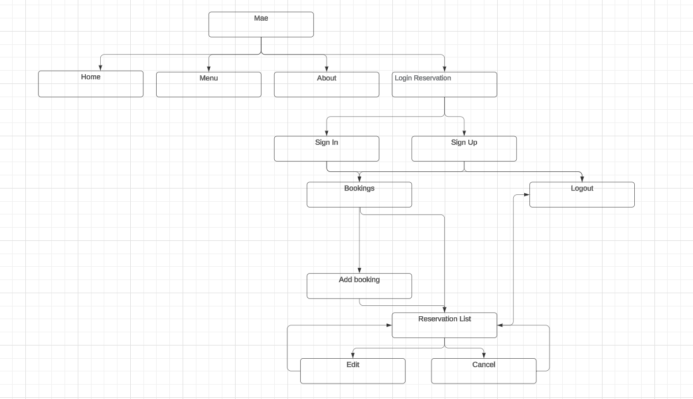

# **Mae restaurant**

![responsicemockup]https://ui.dev/amiresponsive?url=https://mae-restaurant-fd1d9cf11a78.herokuapp.com/

![herokuapp]https://mae-restaurant-fd1d9cf11a78.herokuapp.com/

## Project

### Project Goals
The main objective of this project was to create a website for a restaurant, providing customers with the opportunity to explore the offer. In addition to allowing users to reserve a table as members or first-time visitors, the application allows these users to update or delete their own reservations. Staff members, on the other hand, can create reservations for customers and have the authority to modify or delete them. In summary, the site aims to offer a comprehensive experience for users and staff in discovering the restaurant and managing reservations.

### User Goals
* The application allows users to sign up with an email address and a password, and then make a restaurant reservation. They will subsequently be able to edit or cancel their own reservations. 

* Staff members will have the ability to create reservations for customers and will have the authority to edit or delete any customer's reservations.

# UX

### **Audience Definition**

A restaurant is a limited space where not everyone can be accommodated. This place aims to offer future customers a pleasant and friendly experience for a defined period. Regarding the website, it should reflect the type of restaurant, enabling the filtering of a specific clientele. The determination of the potential customer begins with the visit to the website, where they can get an idea of the place.

### **User Stories**

Here is a concise list of actions that a potential user might consider during their visit to this website:

As a user, I want to:

Land on a homepage presenting the core content of the site and providing intuitive navigation.
Access a menu section to get an overview of the available options.
Learn more about the restaurant and its features.
Make a reservation without having to subscribe to a newsletter or other services.

Second Visit:

As a subscribed user, I want to:

Be able to register on the site to create an account allowing access to the history and future reservations.
Make new reservations as a registered user.
Have the option to modify and/or delete the reservations I've made.
Be able to log out and log back into the site without encountering any specific difficulties.

# Features to Implement in the Future Versions

While the website fulfills the basic functions of a restaurant site, there are additional features that could be added:
Visual Gallery: Integrate an attractive photo gallery showcasing the restaurant's ambiance, popular dishes, and special moments to give visitors a better idea of the experience they can expect.

Reviews and Testimonials: Add a section where customers can leave reviews and testimonials. 
Implementation of a personalized and effective newsletter service that stands out from other newsletter services.
Integration of a system to send discounts to registered users.
Online Loyalty Program: Establish an online loyalty program to reward frequent customers with special offers, discounts, or exclusive benefits.
Reservation Customization Options: Offer customers the ability to specify special requests during reservations, such as dietary preferences or particular celebrations.

## Planning
Project planning was done with Agile methodologies.

## Website Design

### Color Palette:

* Primary (Background): #abb8c3 (a shade of gray-blue)
* --white-Smoke: #F9F9F9; 
* Text: green #497569 
The primary background (gray-blue) will provide an interesting visual contrast.

### Fonts:

Headings: Noto Serif Georgian, sans-serif

Body Text: Noto Serif Georgian, sans-serif

Noto Serif Georgian a serif font that adds a touch of elegance.

I use the same color palette throughout the entire site to create a cohesive and harmonious experience.

# Wireframes

The following designs are from the initial concept of the website. During the development process, some changes have been made to better fit and improve the user experience.

- site map

- Entity-Relationship Diagram (ERD)

This diagram illustrates the primary relationships among the following entities, illustrating how users are connected to bookings and tables. It serves to outline the foundational structure of a restaurant reservation management system.

- Base template wide

- Base template phone

- Header
At the top right, you'll find the restaurant's logo along with links to the three main pages. This will give you easy access to all pages. The navigation bar includes links to the Home, Menu, About and Login - Reservation. It remains consistent across all pages, allowing users to navigate easily between them.

- Footer

Here are the various links to social media platforms such as Facebook and Instagram for Mae restaurant, along with its contact information. We will include them on all pages for a consistent experience across the site.

# Technologies Used
### Programming Languages
This project uses Python, htlm, Css

### Frameworks, Libraries and Programs

* [codeanywhere](https://app.codeanywhere.com/)  
  For Integrated Development Environment.

* [GitPod](https://www.gitpod.io/)  
  For Integrated Development Environment.

* [GitHub](https://github.com/)  
  For storing the repository.

* [heroku Pages](https://dashboard.heroku.com/apps)  
  For deploying the website live.

# Technologies Used

Below is a list of the main technologies used for this project.

* HTML5 / CSS
* Bootstrap
* Python
* JavaScript
* cloudjango allauth library
* django
* gunicorn
* elephantsql
* postgresql
* Google fonts

# Deployment

The project was deployed following the instructions provided by the Code Institute.

- Create new app in heroku
- Setup the setting in Heroku

   Config Vars
    * CLOUDINARY_URL
    * DATABASE_URL
    * DEVELOPMENT
    * DISABLE_COLLECTSTATIC
    * SECRET_KEY

- Setup the deploy in Heroku
    * Link Heroku app to the repository Githup
    * Chose the deployment method

- Click on view to see the app

# Testing

## Lighthouse

Lighthouse is a tool provided by Google Chrome DevTools and allows to identify the site performance, accessibility and user experience on Mobile and Desktop.
All the pages from the website have been tested with Lighthouse.

## Validator testing

No major errors were found when passing through the PEP 8 and the W3 HTML Validator

### Manual Testing

[TESTING](TESTING.md)

| Test Description   | Steps to Reproduce | Expected Result  | Note   |
|--------------------|--------------------|------------------|--------|
| Ability to browse the web page on different browsers | Try the web page on Safari, Chrome, Firefox, Brave, Edge | The website loads successfully on each browser    | Ensure compatibility across major browsers |

| Test Description   | Steps to Reproduce | Expected Result  | Note   |
|--------------------|--------------------|------------------|--------|
| Ability to browse the website pages       | Navigate from main page using navigation bar                                        | User is redirected to selected page                                              | Verify navigation functionality throughout the site                      |

    
    
    

| Test Description   | Steps to Reproduce | Expected Result  | Note   |
|--------------------|--------------------|------------------|--------|
| Ability to register to the website        | Click sign-up link, fill form, submit                                                | User data is registered. Appearance in the navigation bar of a booking and logout link.                         | Appropriate warning messages for errors or fields to be filled in.             |

    
    
    

| Test Description   | Steps to Reproduce | Expected Result  | Note   |
|--------------------|--------------------|------------------|--------|
| Ability to Log in                         | Click log-in link, enter credentials, log in                                         | Successful login, appropriate warnings for incorrect credentials                | Test various scenarios (valid login, invalid password, etc.)              |

    
    
    

| Test Description   | Steps to Reproduce | Expected Result  | Note   |
|--------------------|--------------------|------------------|--------|
| Ability to Log out                        | Click logout link                                                                    | User is logged out. UI reflects logout state                                     | Ensure session management and UI updates correctly                        |

    
    
    

| Test Description   | Steps to Reproduce | Expected Result  | Note   |
|--------------------|--------------------|------------------|--------|
| Ability to book a table                   | Click add booking link, fill out form, submit                                        | Booking is added to reservation list. validation for missing information         | Test different scenarios (valid booking, forgetting to fill in various fields like name, phone number, time, etc.).   |

    
    
    

| Test Description   | Steps to Reproduce | Expected Result  | Note   |
|--------------------|--------------------|------------------|--------|
| Ability to view the reservations          | Log in, navigate to bookings page                                                    | Reservations are visible. Options to edit and delete                            | Check user access rights and reservation display                          |

    

| Test Description   | Steps to Reproduce | Expected Result  | Note   |
|--------------------|--------------------|------------------|--------|
| Ability to edit the reservations          | Log in, navigate to bookings page, select reservation, press edit                   | Details of reservation are editable                                              | Verify editing functionality and the ability to change information.                         |

    
    
    

| Test Description   | Steps to Reproduce | Expected Result  | Note   |
|--------------------|--------------------|------------------|--------|
| Ability to delete the reservation         | Log in, navigate to bookings page, select reservation, click delete                 | Confirmation prompt for deleting reservation                                      | Test deletion process and confirmation message                             |

    
    

| Test Description   | Steps to Reproduce | Expected Result  | Note   |
|--------------------|--------------------|------------------|--------|
| Ability to access the website as an admin | Log in with admin credentials                                                       | Admin access granted based on superuser permissions                              | Test admin login functionality and access rights                           |
| Ability to see all reservations as an admin | Log in with admin credentials, navigate to bookings page                             | All reservations are visible to admin                                            | Check admin view permissions and reservation display                       |
| Ability to edit reservations as an admin  | Log in with admin credentials, navigate to bookings page, select reservation, press edit | Details of reservation are editable                                              | Ensure admin editing rights and data persistence                           |
| Ability to delete reservations as an admin | Log in with admin credentials, navigate to bookings page, select reservation, click delete | Confirmation prompt for deleting reservation                                      | Test admin deletion process and confirmation message                       |

## Bugs
example of bug :

* error login logout 

since implanted allauth i can't login or log out.

Forbidden (Origin checking failed - https://8000-edouard102-maerestauran-i5joeeajh4a.ws-eu110.gitpod.io does not match any trusted origins.): /admin/login/ [31/Mar/2024 11:10:18] "POST /admin/login/?next=/admin/ HTTP/1.1" 403 2615

solution fund

in https://stackoverflow.com/questions/77208322/forbidden-origin-checking-failed-https-api-example-com-does-not-match-any-t

add in settings the code
added from https://stackoverflow.com/questions/77208322/forbidden-origin-checking-failed-https-api-example-com-does-not-match-any-t 
SECURE_PROXY_SSL_HEADER = ("HTTP_X_FORWARDED_PROTO", "https")

* error loading css with heroku

Refused to apply style from 'https://mae-restaurant-fd1d9cf11a78.herokuapp.com/static/css/base.css' because its MIME type ('text/html') is not a supported stylesheet MIME type, and strict MIME checking is enabled.

solution fund

correctly configure whitnoise settings

* Error: Server Error (500) when deployed on Heroku.

solution fund 

in https://stackoverflow.com/questions/44221653/deploying-django-to-heroku-server-error-500

change the files

STATICFILES_STORAGE="whitenoise.storage.CompressedManifestStaticFilesStorage"

by this:

STATICFILES_STORAGE =  'django.contrib.staticfiles.storage.StaticFilesStorage'

But creates an issue with loading the CSS when debug is false.
 
        - Error loading css with heroku 

Refused to apply style from 'https://mae-restaurant-fd1d9cf11a78.herokuapp.com/static/css/base.css' because its MIME type ('text/html') is not a supported stylesheet MIME type, and strict MIME checking is enabled.

solution fund 

in https://stackoverflow.com/questions/59972571/mime-type-issue-loading-css-with-django-app 

need to run $ python3 manage.py collectstatic before pushing to Heroku.

## bugs unfixed

* Error on the validator.w3

On the page https://mae-restaurant-fd1d9cf11a78.herokuapp.com/accounts/signup/, errors are still present

The error comes from the line 99,

The code was provided by allauth.

# Credit
Code institute for the deployment terminal.

### Acknowledgments. :

Special thanks to all Code Institute's team ("Teacher", Lecturers and Tutors) that are making me more knowledgeable and are making this happen.

Huge thank you to the [Slack](code-institute-room.slack.com) community, all its members and all the leads and tutors for their help and support.

Thanks to my mentor Rohit Sharma for guiding me through this project.